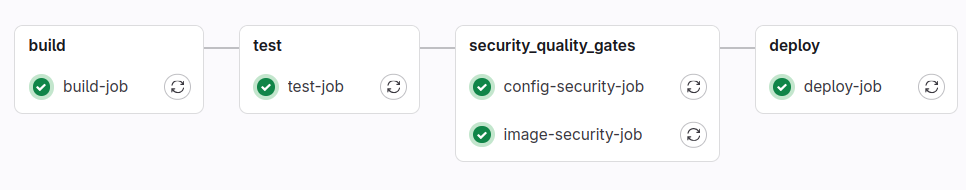

# Pet-проект построения пайплайна

* [Структура проекта и порты](#структура-проекта-и-порты)
* [Канбан доска](#канбан-доска)
* [Текущий пайплайн и архитектура](#текущий-пайплайн-и-архитектура)
* [Шаг 1 - Локальный gitlab server, runner, простейший CI&CD](#шаг-1---развертывание-локального-gitlab-server-и-gitlab-runner-простейшего-cicd-h1)
* [Шаг 2 - Trivy для сканирования образа и Dockerfile (vuln,secret,misconfig)](#шаг-2---trivy-для-сканирования-образа-и-dockerfile-vulnsecretmisconfigh1)
* [Шаг 3 - Перевод runner в докер](#шаг-3---перевод-runner-в-докер)
* [Шаг 4 - Перевод инфраструктуры в k8s](#шаг-4---перевод-инфраструктуры-в-k8s)
* [Шаг 5 - HashiCorp Vault без интеграций](#шаг-5---hashicorp-vault-без-интеграций)

# Структура проекта и порты

Порты:

- localhost:80 - Gitlab
- localhost:8080 - Сервис FAST API приложения
- localhost:8200/ui - HashiCorp Vault

Структура проекта:  
├── docker-compose.yaml  
├── Dockerfile  
├── infrastructure ?????? 
│   └── docker-compose.yaml  
├── instructions - Инструкции  
├── kube - Манифесты кубера  
│   ├── fastapi-deployment.yaml - Манифест развертывания  
│   └── fastapi-service.yaml - Манифест хостинга  
├── main.py  
├── pics  
├── README.md   
├── requirements.txt  
├── sonarqube - SAST-сервер  
│   └── docker-compose.yaml  
├── test_myapp.py  
└── vault  
│   ├── requirements.txt  
│   ├── vault_client.py  
│   └── vault.hcl - конфигурация хранилища  

# Канбан доска

| TODO                                                          | Done                                                        |
|---------------------------------------------------------------|-------------------------------------------------------------|
| компоуз для служебных контейнеров (гитлаб, раннер, sast/ sca) |                                                             |
| кафка                                                         |                                                             |
| пайплайн с условиями                                          |                                                             |
| канареечный деплой                                            |                                                             |
| триви расширить на манифесты и чарты                          |                                                             |
| графана                                                       |                                                             |
| helm-charts                                                   | переменные в гитлаб                                                             |
| k8s ingress                                                   | HashiCorp Vault (внедрение без интеграций и side-car подов) |
| k8s привязать к пайплайну                                     | перевод инфраструктуры в k8s (/kube)                        |
| dast (owasp zap)                                              | перевод runner в докер                                      |
| sast (sonarqube)                                              | SCA анализ на пре-билд и билд этапах через trivy            |
| apparmour                                                     | baseline pipeline                                           |
| tetragon                                                      | FAST-API приложение и тесты (/src)                          |
| dependency check                                              | локальный gitlab и runner                                   |

# Текущий пайплайн и архитектура

# Шаг 1 - Локальный gitlab server, runner, простейший CI&CD

- запуск локального gitlab server и gitlab runner</h3>
- зарегистрируем и запустим gitlab runner (В роли раннера - shell)
- напишем простое fastapi приложение и тест к нему (/src/main.py, /src/test_myapp.py)
  Подробнее в instructions/step1

# Шаг 2 - Trivy для сканирования образа и Dockerfile (vuln,secret,misconfig)

- сканирование Dockerfile (SCA на этапе пре-билда)
- исправление ошибок после сканирования (запуск не из-под рута)
- сканирование образа (SCA на этапе билда)
- исправление ошибок после сканирования (обновление пакетов и переход на легковесный базовый образ)

флаги: --scanners vuln,secret,misconfig  
Результат после:  
http://localhost/root/secure_pipeline/-/pipelines/39  
Total: 0 (HIGH: 0, CRITICAL: 0)  

Подробнее в instructions/step2

# Шаг 3 - перевод runner в докер

Подробнее в instructions/step3

# Шаг 4 - перевод инфраструктуры в k8s

- создадим манифест развертывания
- создадим манифест сервиса для прокидывания порта
  Подробнее в instructions/step4  
  /kube - манифесты  

Подробнее в instructions/step4

# Шаг 5 - HashiCorp Vault без интеграций
- создадим контейнер Vault с указанием конфига хранилища (hault.hcl)
- запустим контейнер
- зарегистрируем администратора системы
- напишем vault-клиента на питоне
- зарегистрируем способ аутентификации «AppRole», зарегистрируем роль
- применим политику доступа к секретам для этой роли

<h3>Встраивание без интеграции не решает проблему "нулевого секрета"</h3>

Подробнее в instructions/step5
