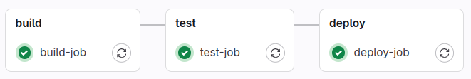

# Шаг 1 - Локальный gitlab server, runner, простейший CI&CD

* [Результат](#результат)

<h3>Запуск локального gitlab server и gitlab runner</h3>

Запустим локальный гитлаб в докере:

```
docker run --detach \
  --hostname gitlab.local \
  --publish 8443:443 --publish 8080:80 --publish 2222:22 \
  --name local_gitlab \
  --volume /srv/gitlab/config:/etc/gitlab \
  --volume /srv/gitlab/logs:/var/log/gitlab \
  --volume /srv/gitlab/data:/var/opt/gitlab \
  gitlab/gitlab-ce:latest
```

Для дальнейшего старта контейнера

``````
docker start local_gitlab
``````

Зарегистрируем раннер:

```
gitlab-runner register  --url http://localhost  --token my_token </code>
```

Запустим раннер:

```
gitlab-runner run
```

В роли раннера - shell

<h3> Fast API приложение </h3>
Напишем простое fastapi приложение (/src/main.py), которое будем собирать в пайплайне в докер контейнере

<br> Напишем один тест (/src/test_myapp.py), который будет выполняться на шаге тестирования 
<br> До приложения можно достучаться по localhost:8080 (идет проброс порта с контейнерного 8000 )

# Результат


