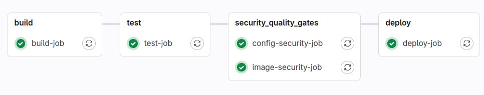

# Шаг 2 - Trivy для сканирования образа и Dockerfile (vuln,secret,misconfig)

* [Результат](#результат)
  <h2>Сканирование Dockerfile</h2>

```
trivy config --severity LOW,MEDIUM,HIGH,CRITICAL ./Dockerfile
```

Ошибки исправленные благодаря этой проверке

1) запуск контейнера не из-под рута

<h2>Внедрим сканирование образа через trivy в пайплайн </h2>

``` 
- trivy image --exit-code 1 --severity HIGH,CRITICAL fastapi_image  # Сканируем образ
```

Для запуска сканирования локально (вне пайплайна)

```
Сканирование уязвимостей
sudo trivy image --exit-code 1 --severity MEDIUM,HIGH,CRITICAL fastapi_image

Сканирование секретов
sudo trivy image --exit-code 1 --scanners secret --severity MEDIUM,HIGH,CRITICAL fastapi_image

Сканирование конфигураций
sudo trivy image --exit-code 1 --scanners misconfig --severity MEDIUM,HIGH,CRITICAL fastapi_image
```

Результат сканирования для старого образа: </br>
http://localhost/root/secure_pipeline/-/jobs/54 </br>
Total: 121 (HIGH: 115, CRITICAL: 6) </br>

Исправление уязвимостей:

1) воспользуемся более легковесными контейнерами (в образе будет ОС с меньшим числом пакетов)
2) принудительное обновление setuptools

Результат после:
http://localhost/root/secure_pipeline/-/pipelines/39
Total: 0 (HIGH: 0, CRITICAL: 0)

# Результат


