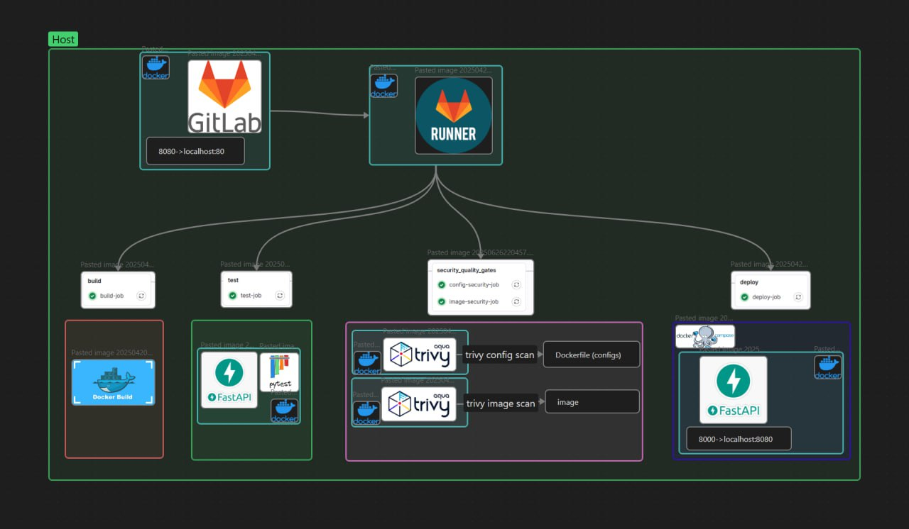

# Шаг 3 - перевод runner в докер

* [Результат](#результат)

1) создадим докер контейнер раннера

```
docker run -d --name gitlab-runner   -v /srv/gitlab-runner/config:/etc/gitlab-runner   -v /var/run/docker.sock:/var/run/docker.sock   gitlab/gitlab-runner:latest
```

3) зарегистрируем инстант раннера

```
docker exec -it gitlab-runner gitlab-runner register
```

укажем docker, как исполнитель, и токен

3) так как мы хотим, чтобы раннер создавал контейнеры пайплайна на хосте, а не в DinD, пробросим сокет docker

```
sudo nano /srv/gitlab-runner/config/config.toml (монтированный том)
volumes = ["/var/run/docker.sock:/var/run/docker.sock", "/cache"]
```

5) для запуска необходимо выполнить следующую команду:

```
docker start gitlab-runner
```

# Результат

